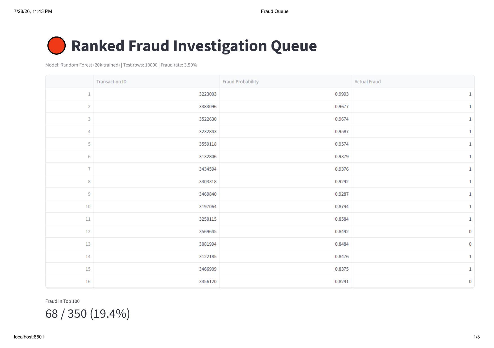
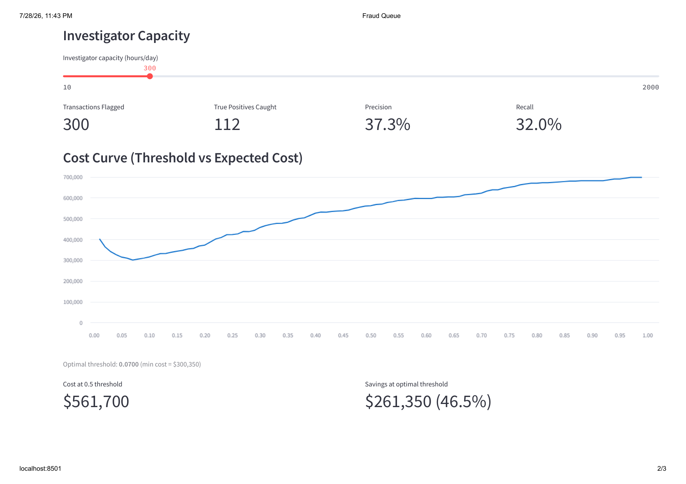

#Transaction Fraud Detection (Cost-Weighted)

An interpretable, cost-aware fraud detection system using the IEEE-CIS Fraud Detection dataset (Kaggle). Outputs a ranked investigation queue with capacity-aware precision/recall and a cost-weighted threshold optimizer.

**Dataset:** IEEE-CIS Fraud Detection — `train_transaction.csv` + `train_identity.csv`, merged on `TransactionID`. Target: `isFraud` (3.5% positive class). Raw data not included in this repo — [download from Kaggle](https://www.kaggle.com/c/ieee-fraud-detection) to reproduce the full pipeline.

**Model:** Random Forest (200 trees, max_depth=12, class_weight='balanced'), trained on a 20k stratified subsample due to local memory constraints (4 GB RAM).

---

## Dashboard

### Ranked Fraud Queue


### Cost Curve & Investigator Capacity


---

## Model Performance (Random Forest)

| Metric | Value |
|--------|-------|
| Cost-optimal threshold | 0.07 |
| Cost at that threshold | $300,350 |
| Cost at default 0.5 threshold | $561,700 |
| Savings vs default | 46.5% |
| Recall at cost-optimal threshold | 84.6% |
| Precision at cost-optimal threshold | 7.1% |

Cost matrix used: FN = $2,000, FP = $50 (assumed business figure, not fitted from data).

**Investigator capacity (10k held-out dashboard sample):** at capacity k=300, catches 112 true positives (37.3% precision, 32.0% recall) — a different metric than the cost-optimal threshold above.

A Logistic Regression baseline was also tested; its best-case cost was $3,765,800 (~7× worse), so Random Forest was selected.

---

## Limitations

1. Trained on a 20k stratified subsample, not the full 472k training set (local memory constraints).
2. Cost matrix is an assumed business figure, not fitted from data.
3. Low precision — most flagged transactions are false positives (7.1% at cost-optimal threshold).
4. No temporal validation — random stratified split, not time-based; likely overstates real-world performance.
5. No probability calibration — cost optimization assumes well-calibrated scores.
6. Single random seed (42) — no confidence intervals or variance estimates.

---

## Repository Structure

```
Data/ieee-cis/
├── models/
│   └── rf_model.pkl              # Trained Random Forest — used by dashboard
├── outputs/
│   └── rf_cost_analysis.parquet  # Cost curve (99 thresholds) — used by dashboard
├── test_working_rf.parquet       # 10k test sample — used by dashboard
├── dashboard.py                  # Streamlit dashboard
└── README.md
```

Raw Kaggle data and intermediate pipeline files are excluded via `.gitignore` (size + regenerable from source).

---

## Running the Dashboard

```bash
cd Data/ieee-cis
streamlit run dashboard.py
```
